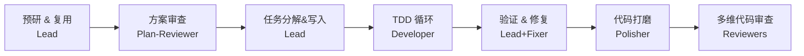
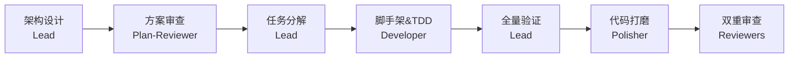
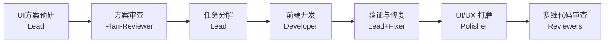
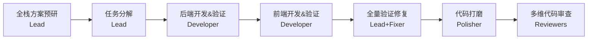

# 🤖 AI Messy

[](https://docs.anthropic.com/en/docs/claude-code)
[](LICENSE)

> **为 Claude Code 打造的生产级 AI Agent 工作流与开发规范技能合集（中文）**

AI Messy 提供了一套完整的结构化开发工作流，集成了基于 TDD 的任务管理、多 Agent 团队编排、代码审查与质量保障工具，致力于帮助开发者在 AI 辅助下实现高信噪比、高质量的渐进式交付。

## 🚀 前置条件

- [Claude Code](https://docs.anthropic.com/en/docs/claude-code) CLI 已安装并可用
- 已通过 `claude` 命令进入 Claude Code 交互界面

## 📦 安装

```bash
# 1. 添加 marketplace
/plugin marketplace add HarryJLS/ai_messy

# 2. 安装插件
/plugin install ai_messy@ai_messy
```

安装完成后，所有 `/skill-name` 命令即可在任意项目中使用。

---

## 🌟 日常推荐工作流（Best Practices）

**后端开发工作流（最常用）：**
由于复杂需求在单次会话中容易达到上下文瓶颈，强烈推荐使用以下**“跨会话两步走”**策略：
1. **阶段一 (会话 A)**: `/plan-init` ➔ 专注需求讨论、架构梳理与任务拆解，确保思路完全清晰。
2. **阶段二 (全新会话 B)**: `/backend-single` ➔ 提供纯净的上下文，Agent 将自动读取阶段一的产物（`features.json`），专注、高效地完成所有代码编写与简化逻辑。

**全栈开发工作流：**
1. **会话 A**: `/plan-init` (分解任务，标记 domain + apiContracts)
2. **会话 B**: `/backend-single` (执行 backend 任务)
3. **会话 C**: `/frontend-single` (执行 frontend 任务)
4. **会话 D**: `/backend-test` / `/frontend-test` (集成与测试验证)

---

## 🛠️ Skills 总览

### 📋 开发流程 (Workflow)

基于 TDD 的结构化开发工作流，支持任务管理、统一日志、上下文恢复。

| 命令 | 用途 |
|------|------|
| `/plan-init` | 需求分析和任务分解（三档自适应：模糊需求→深度模式，明确文档→标准模式，已有JSON→极速模式） |
| `/plan-write` | 读取审批后的计划文件，写入 `features.json` 和 `dev-YYYY-MM-DD.log` |
| `/plan-next` | 执行下一个任务（TDD: RED 🔴 → GREEN 🟢 → COMMIT 📦） |

**手动执行流程：**
`/plan-init` ➔ `/plan-write` ➔ `/plan-next` (循环执行)

### 👥 Agent 团队编排 (Team Orchestration)

多 Agent 团队编排模式，自动串联完整开发流水线，无需手动逐个调用。

| 命令 | 适用场景 | 核心动作 |
|------|----------|----------|
| `/backend-team` | 现有后端项目开发 | 预研 + 初始化 + TDD开发 + 简化 + 多维CR |
| `/framework-team` | 从零搭建新项目 | 架构设计 + 脚手架生成 + TDD开发 + 验证 + CR |
| `/frontend-team` | 前端开发 (React/Vue) | UI系统设计 + 方案预研 + 开发 + UI/UX打磨 + CR |
| `/fullstack-team` | 全栈项目开发 | 后端预研 + 前端设计 → 后端开发 → 前端对接 → CR |

> 💡 *详见下方 [团队编排详情](#-团队编排详情) 章节获取流水线架构图。*

### ⚡ 精简版编排 (Single Mode)

无 Agent Team、无方案预研、无 CR，适合跨会话独立执行。需先运行 `/plan-init` 完成任务分解。

| 命令 | 适用场景 | 执行链路 |
|------|----------|----------|
| `/backend-single` | 后端开发 | plan-write → plan-next 循环 → simplifier → fixer |
| `/frontend-single`| 前端开发 | plan-write → plan-next 循环 → UI/UX 检查 → simplifier → fixer |
| `/fullstack-single`| 全栈开发 | plan-write → 后端 plan-next → 前端 plan-next → simplifier → fixer |


### 💎 代码质量 (Code Quality)

| 命令 | 用途 | 支持的规范标准 |
|------|------|----------------|
| `/code-review` | 审查代码变更，自动检测语言并应用规范 | Java(阿里规范)、Go(字节规范)、React/Vue、Python |
| `/code-fixer` | 自动修复代码规范问题 | 小修自动，大改需确认，**严禁修改命名** |
| `/code-simplifier` | 简化优化代码，提升可维护性 | 提升清晰度、一致性，保持原有功能不变 |

### 🧪 测试与验证 (Testing & Verification)

| 命令 | 用途 |
|------|------|
| `/unit-test` | 自动检测语言，生成符合最佳实践的单元测试 (支持 Go, Java 等) |
| `/backend-test` | 后端测试验证（单元测试 + API 契约验证 + 验收标准检查） |
| `/frontend-test` | 前端测试验证（已有测试 + E2E 验证 + 验收标准检查） |

### 🧰 实用工具 (Utilities)

**Git 操作**
- `/git-quick`: 快捷 pull/commit/push/checkout 一键完成。
- `/git-worktree`: Git worktree 创建、删除与查看。

**项目与知识管理**
- `/claude-md-manager`: 管理项目 `CLAUDE.md`，结构化沉淀开发经验。
- `/add_or_update_skill`: 同步 skill 到多平台。
- `/setup-permissions`: 配置 Claude Code 权限白名单。
- `/skill-creator` / `/find-skills`: 创建新 Skill 或发现/安装现有 Skill。

**持续学习与设计辅助**
- `/learn` / `/instinct`: 提取可复用模式，原子级观察与学习。
- `/ui-ux-pro-max` / `/frontend-design`: 强大的 UI/UX 设计智能与生成能力。
- `/markitdown`: 格式转换神器 (PDF/DOCX/图片 等转为 Markdown)。

---

## 🏗️ 团队编排详情

### `/backend-team` (现有后端项目)



### `/framework-team` (新项目脚手架)

阶段 1 用架构设计（技术栈选择 → 目录结构 → 模块划分）替代现有代码探索。



### `/frontend-team` (前端开发)

阶段 1 集成设计智能，阶段 4 增加 UI/UX Pre-Delivery 检查。



### `/fullstack-team` (全栈开发)

先设计后端与 API 契约，后开发前端，全链路闭环。



---

## 📂 目录结构

```text
ai_messy/
├── .claude-plugin/        # Plugin 清单与配置
│   ├── plugin.json
│   └── marketplace.json
├── agents/                # 项目级 Agent Prompt 定义
│   ├── build-error-resolver.md
│   ├── code-architect.md
│   ├── code-reviewer.md
│   └── security-reviewer.md
├── skills/                # 核心技能合集 (包含 30+ 细分功能)
│   ├── plan-*/            # 任务规划系列 (init, write, next)
│   ├── backend-*/         # 后端专精编排与测试
│   ├── frontend-*/        # 前端专精编排与测试
│   ├── fullstack-*/       # 全栈全链路编排
│   ├── framework-team/    # 从零搭建脚手架
│   ├── code-*/            # 代码质量审查与修复 (review, simplifier)
│   ├── git-*/             # 版本控制快捷工具
│   └── ...                # 工具类 (markitdown, notebooklm 等)
├── common/                # 共享参考规范与基准文档
├── CLAUDE.md              # AI Messy 自身的演进规则与记忆
├── LICENSE                # MIT 协议
└── README.md              # 本文档
```

---

## 🎯 设计原则

1. **资深开发视角**：恪守 KISS 原则，考虑代码的复用性、扩展性和健壮性，拒绝过度设计。
2. **第一性原理**：以客观事实（配置文件、现有代码）为最高准则，精准执行，不碰无关代码。
3. **TDD 优先**：严格践行测试驱动开发，先 RED 编写测试，后 GREEN 补齐实现。
4. **上下文无缝恢复**：高度结构化的日志与状态设计，支持跨会话时状态的快速热重载。

---

## 📄 许可证

[MIT License](LICENSE)
